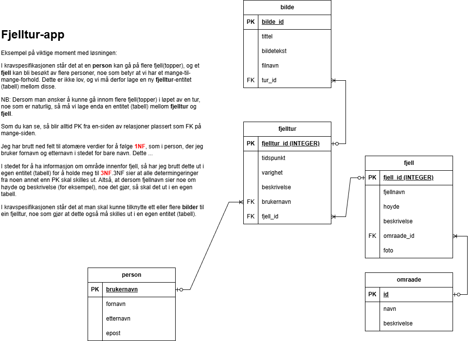
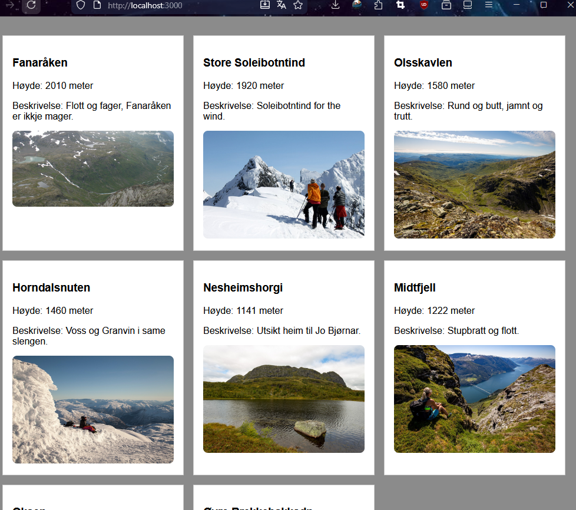

# Eksempel: Fjellturer

## Planlegging

Prosjektbeskrivelse: En venn av deg har kommet på en idè til en app, der folk kan registrere fjelltopper de går på gjennom året. Vennen har derimot ikke peiling på hva som kreves for å kunne lagre denne informasjonen, og ber deg om å hjelpe til med planlegging av "backend". I første omgang skal du altså lage en datamodell, og forklare den.

Etter et møte med vennen din, sitter du igjen med en liste med krav: 
- alle data er tilknyttet en person
- registrere fjell/fjelltopp
- registrere områder, som Jotunheimen, Hardanger, Bergen, Lofoten, Vossafjella, Femundsmarka etc. med tilhørende - informasjon om disse
- registrere tidspunkt for turen
- registrere hvor lang tid turen tok 
- registrere en beskrivelse/oppsummering av turen 
- legge ved en eller flere bilder

Kommentarer:
- Når det gjelder område, som du blir bedt om å ha med, så er altså tanken at du kan lage noen typiske turområder eller regioner, ikke ferdigdefinerte fylker eller kommuner.
- En person kan gå mange turer til samme fjell.
- En fjelltopp kan bli besøkt av mange personer.
- Ta dine egne forutsetninger der det er aktuelt, og du mener det mangler informasjon. Skriv ned disse forutsetningene, og utvid gjerne datamodellen - og etter hvert databasen.

Lag datamodellen, og forhold deg til normaliseringsreglene.

## Eksempel på datamodell



NB: Kommentarene er ikke grundige nok til å forklare alle deler av modellen, men er eksempel på hvordan du kan tenke når du skal gjøre dette.

NB2: Her kan man bare gå et fjell per tur, og det kan ikke gå flere personer på samme tur. Dette er for å gjøre det enklere å lage datamodellen, og senere databasen, men det er ikke nødvendigvis slik det må være i en virkelig applikasjon. Det er helt greit å utvide datamodellen, og gjøre den mer kompleks, hvis du ønsker det. Det viktigste er at du forstår hvordan de forskjellige delene henger sammen, og at du kan forklare det.

## Lage databasen

Bruk SQLite3, eller andre verktøy du er komfortabel med, for å lage databasen basert på datamodellen du har laget.

Legg også inn testdata, slik at du har noe å jobbe med når du skal lage spørringer og senere en webapplikasjon.

Lettvint løsning:
- Se [fjelltur.db](fjelltur.db) for en ferdig database som du kan bruke, og som inneholder testdata. Du kan åpne denne i et verktøy du foretrekker, og se hvordan den er bygget opp, og hvilke data som ligger i den.

## Oppgaver: SQL

Øv deg på å "spørre" databasen, og hente ut den informasjonen du er interessert i. 

Her kan du finne oppgaver og løsningsforslag for SQL-spørringer mot denne databasen: [SQL - oppgaver og løsningsforslag](./SQL%20-%20oppgaver%20og%20løsningsforslag.md)

## Lage en webapplikasjon

Vi skal nå lage en enkel webapplikasjon som kan hente data fra SQLite-databasen, og vise det i en nettleser. Vi skal bruke Node.js og Express for å lage en enkel server, og `better-sqlite3` for å håndtere SQLite-databasen.

Sluttproduktet kan se slik ut:



Her følger en steg-for-steg guide for hvordan du kan lage dette.

### Initialisere et nytt Node-prosjekt

Lag deg først en ny mappe for prosjektet, og flytt database-filen inn i denne.

Deretter initialiser du et nytt Node-prosjekt i denne mappen. Åpne terminalen, naviger til mappen, og kjør følgende kommando:

```bash
npm init -y
```

Kontroller at `package.json` har blitt opprettet, og at det inneholder en "main" som peker på `app.js` (eller hva du har valgt å kalle hovedfilen din).

Merk deg at du skal lagre all koden for webapplikasjonen din i denne mappen, og det er her du skal installere nødvendige avhengigheter. Følg med på instruksjonene, da du etter hvert må opprette nye mapper og filer for å kunne lage en fungerende applikasjon.

### Installere nødvendige avhengigheter

Fortsatt fra terminalen; kjør følgende kommando for å installere Express, better-sqlite3 og CORS:

```bash
npm install express better-sqlite3 cors
```

Kontroller at `package.json` har blitt oppdatert med de nye avhengighetene, og at det har blitt opprettet en `node_modules`-mappe med disse pakkene.

Tenk etter hva du har gjort. Hva er Express? Hva er better-sqlite3? Hva er CORS?

### Ikke last opp node_modules til GitHub

Det er vanlig praksis å ikke laste opp `node_modules`-mappen til GitHub, da denne kan være veldig stor, og den uansett inneholder filer som kan gjenopprettes ved å kjøre `npm install` basert på `package.json`. For å unngå at `node_modules` blir lastet opp, kan du opprette en `.gitignore`-fil i rotmappen av prosjektet ditt, og legge til følgende linje i denne filen:

```
node_modules/
```

Dette vil fortelle Git at den skal ignorere `node_modules`-mappen, og ikke laste den opp til GitHub. Kontroller at `.gitignore`-filen er opprettet, og at den inneholder denne linjen.

### Lage en enkel Express-server

Vi lager en enkel Express-server som kan håndtere forespørsler og hente data fra SQLite-databasen.

Startkode:

```javascript
// Server-bit, setter opp en Express-app
const express = require('express');
const app = express();

const PORT = 3000;

// Databasen
const Database = require('better-sqlite3');
const db = new Database('fjelltur.db');

// CORS-middleware for å tillate forespørsler fra andre domener
const cors = require('cors');
app.use(cors());

// Eksempel på en rute som henter alle fjell, beskrivelse, høydene og bilde deres
app.get('/api/fjell_info', (req, res) => {
    const rows = db.prepare('SELECT fjellnavn, hoyde, beskrivelse, foto FROM fjell').all();
    res.json(rows);
});

// Åpner en viss port på serveren, og starter serveren
app.listen(PORT, () => {
    console.log(`Server kjører på http://localhost:${PORT}`);
});
```

Du starter serveren ved å kjøre `node app.js` i terminalen.

Kontroller at serveren starter uten feil, at du kan nå `http://localhost:3000/api/fjell_info` i nettleseren, og se dataene fra databasen. Hvilket format får du dataene i? Hvordan kan du bruke dette i en frontend-applikasjon senere?

## Lage en frontend-applikasjon

Vi skal nå bruke `fetch` for å hente data fra API-et ditt, og vise det i en enkel frontend-applikasjon.

Vi må utvide `app.js` for å servere statiske filer, slik at vi kan ha en HTML-fil og tilhørende JavaScript og CSS. Legg til den følgende linjen i `app.js`:

```javascript
// Middleware for å servere statiske filer fra "public" mappen
app.use(express.static('public'));
```

Opprett en mappe som heter `public`, og lag tre filer her:
- `index.html`
- `code.js`
- `style.css`

Koble disse filene sammen.

I `index.html` kan du lage en enkel struktur for å vise dataene, og inkludere `code.js` og `style.css`. For eksempel:

```html
<!DOCTYPE html>
<html lang="en">
<head>
    <meta charset="UTF-8">
    <meta name="viewport" content="width=device-width, initial-scale=1.0">
    <title>Fjell</title>
    <script src="code.js" defer></script>
    <link rel="stylesheet" href="style.css">
</head>
<body>
    <!-- Fylles ut av JS -->
</body>
</html>
```

I `code.js` kan du bruke `fetch` for å hente data fra API-et ditt, og vise det i nettleseren. NB: Koden nedenfor skriver bare ut dataene i konsollen, du må selv lage HTML-elementer og legge dataene inn i disse for å vise det på siden.

```javascript
async function fetchData() {
    const response = await fetch('http://localhost:3000/api/fjell_info');
    const data = await response.json();
    console.log(data);
    
    // Her kan du gjøre noe med dataen (vise det frem)
}

fetchData();
```

## Videre arbeid

### Lage flere ruter/API-endepunkter

Lag flere ruter som henter ut forskjellige typer data, der du kan få inspirasjon fra SQL-oppgavene du har løst tidligere.

### Vise innholdet på nettsiden

Bruk eks. `createElement` og `appendChild` for å lage HTML-elementer, og vise dataene på nettsiden. Noter deg spesielt ned hvordan du kan gjøre dette med bilder - der disse per nå ligger inne per fjell, med navnet `foto` i databasen.

Se løsningsforslag for hvordan du kan gjøre dette [her](./public/).

### Stilsetting

Bruk CSS for å gjøre det mer visuelt tiltalende. Du kan lage en `style.css`-fil i `public`-mappen, og linke til den i `index.html`.

Se løsningsforslag for hvordan du kan gjøre dette [her](./public/).