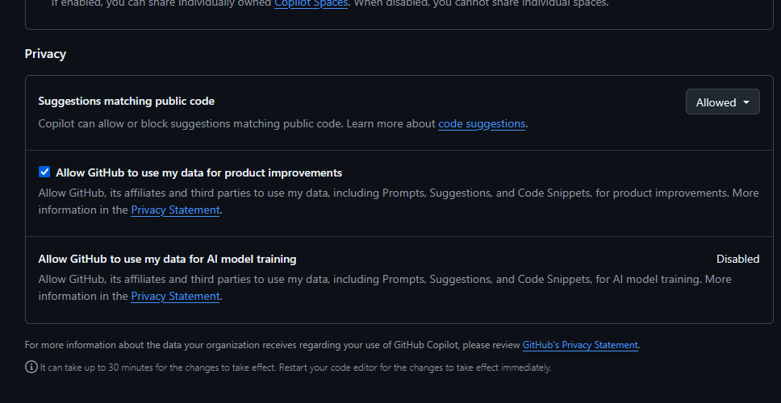

# Om å laste opp koden din til Github

Når du laster opp koden din til Github, er det viktig å være klar over lisensiering og hvordan du ønsker at andre skal kunne bruke koden din. Her er noen viktige punkter å vurdere.

## Generelt om valgene dine, og gjeldende regler

- **Eierskap**: Du beholder full opphavsrett til alt materiale du laster opp som du selv har skapt.
- **Lisens til GitHub**: Ved å bruke plattformen gir du GitHub en begrenset rett til å være vert for innholdet ditt, vise det frem, kopiere det til sine servere og utføre tekniske grep som trengs for at tjenesten skal fungere (for eksempel indeksere det for søk).
- **Offentlige repositorier**: Hvis du velger å gjøre et prosjekt «Public», gir du automatisk andre brukere på GitHub rett til å se på og «forke» (lage en kopi av) repositoriet ditt gjennom GitHubs grensesnitt.
- **Behov for lisens**: Selv om andre kan se koden din i et offentlig prosjekt, betyr ikke det at de har lov til å bruke, endre eller selge den videre. For at andre skal kunne bruke arbeidet ditt lovlig, bør du legge ved en åpen kildelisens (som MIT, Apache eller GPL). Du kan velge en passende lisens på [choosealicense.com](https://choosealicense.com).
- **Private repositorier**: For private prosjekter er det kun du (og de du spesifikt inviterer) som har tilgang til innholdet, og GitHubs ansatte har strengt begrensede rettigheter til å se på koden din, vanligvis kun i support- eller sikkerhetssammenheng.
- **Bidrag fra andre**: Hvis andre bidrar med kode til ditt prosjekt, bør du sørge for at de også godtar lisensvilkårene du har satt for prosjektet, slik at det ikke oppstår juridiske problemer senere.

## Sette en lisens på prosjektet ditt

Du kan bruke GitHubs innebygde lisensvelger for å opprette en ny fil:
1. Gå til hovedsiden for ditt repository på GitHub.
2. Klikk på Add file og velg Create new file.
3. Skriv LICENSE (med store bokstaver) i feltet for filnavn. Da dukker knappen Choose a license template opp til høyre.
4. Klikk på knappen, velg lisensen du ønsker (f.eks. MIT eller Apache), fyll ut eventuelle detaljer, og klikk Review and submit.
5. Klikk Commit changes nederst på siden for å lagre.

## Brukes mine data for å trene AI-modeller?

- **Standard**: All kode i offentlige prosjekter brukes som treningsdata for GitHubs generative KI-modeller (utviklet i samarbeid med OpenAI og Microsoft).
- **Valgfri utmelding (Opt-out)**: Fra 2026 har GitHub gjort det enklere å reservere seg. Du kan nå gå til Settings → Copilot og skroll ned til bunnen av denne siden for å tilpasse valget slik du ønsker. 

- **Tekniske grep**: Du kan også legge til en fil kalt .ai_exclude eller .aiignore i rotmappen på prosjektet ditt for å signalisere at innholdet ikke skal indekseres for trening.

## Oppgaver
Finn ut hvordan disse punktene blir håndtert i konkurrende plattformer som: 
- GitLab 
- Bitbucket
- https://gogs.io/
- https://about.gitea.com/
- https://codeberg.org/