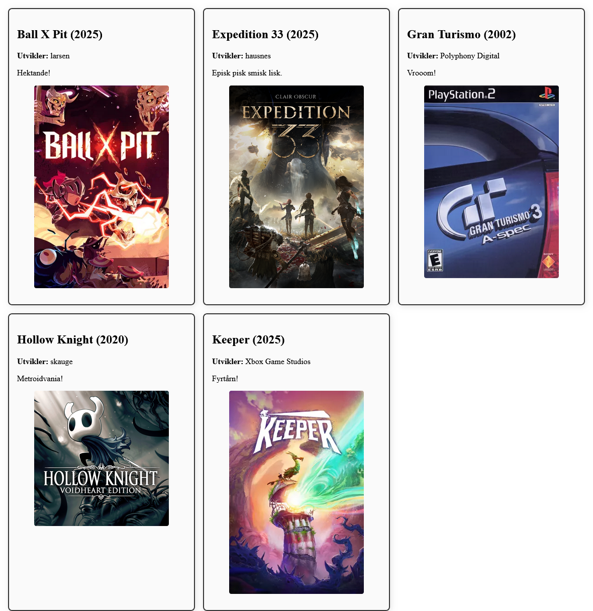
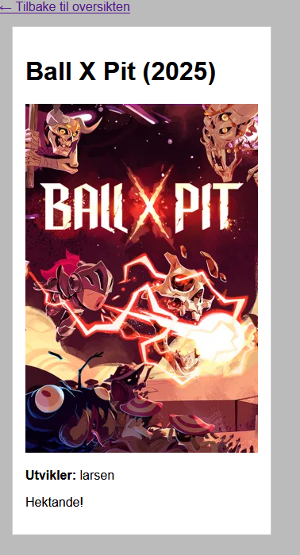

# Spillsamling: Dynamiske sider

Meny:
- [Ideen bak prototypen](#ideen-bak-prototypen)
- [Startsiden: Rute for å hente alle spill](#startsiden-rute-for-%C3%A5-hente-alle-spill)
- [Detaljside: Vise informasjon om **ett** spill](#detaljside-vise-informasjon-om-ett-spill)
- [Videre utvikling](#videre-utvikling)

## Ideen bak prototypen

I dette eksempelet er konseptet at vi har en samleside med spill, som viser alle spillene i databasen. Dette er siden du kommer til når du besøker nettsiden (startsiden). Det skal gå an å trykke på bildet for et gitt spill, som fører deg til en egen side som viser all informasjon om dette spillet.

Målet er at uansett hvor mange spill vi legger til i databasen, så skal nettsiden automatisk oppdatere seg for å vise alle spillene. Dette er en typisk bruk av en database sammen med en webserver og dynamiske nettsider.

I mange sammenhenger så brukes 

Selve nettsiden ser slik ut:

<!--  -->


Etter å trykt på et bilde for et spill, blir du sendt til `spel-detalj.html`, sammen med informasjon om hvilken `id` det gjelder. NB: Denne siden bør stilsettes bedre.

<!--  -->


## Startsiden: Rute for å hente alle spill

### `app.js`

Alle spillene blir som sagt vist på startsiden, som er en HTML-side, med tilhørende CSS og JS. Ruten i `app.js` som håndterer dette ser slik ut:

```js
// Serve statiske filer fra public-mappen
app.use(express.static('public'));

// Standard rute for å sende spelAlle.html AKA startsiden
app.get('/', (req, res) => {
    res.sendFile(__dirname + '/public/spelAlle.html');
});
```

I `public`-mappen ligger filene: `spelAlle.html`, `spelAlle.js` og `style.css`. Husk å aktivere støtten for public-mappen også.

Den enkleste ruten er den som henter alle spill (`/alleSpel`). Vi lager denne først, og sjekker ved å besøke `localhost:3000/alleSpel` at den returnerer alle spillene i JSON-format.

```js
// Eksempel på en rute som henter alle meldingene (og hvem som har skrevet disse, samt tidspunkt)
app.get('/alleSpel', (req, res) => {
    const rows = db.prepare('SELECT * FROM spel ORDER BY tittel ASC').all();
    res.json(rows);
});
```

### `spelAlle.html`

Nettsiden som skal bruke denne ruten for å vise frem alle spillene heter `spelAlle.html`. HTML-en er særs kort, der du kan legge merke til at vi har klargjort et element som vi kan skrive til. Kunne ha brukt body direkte, men pga. stilsetting brukes `<main id="spelsamling"></main>`.

```html
<!DOCTYPE html>
<html lang="en">
<head>
    <meta charset="UTF-8">
    <meta name="viewport" content="width=device-width, initial-scale=1.0">
    <title>Spelvisning</title>
    <script src="spelAlle.js" defer></script>
    <link rel="stylesheet" href="style.css">
</head>
<body>
    <main id="spelsamling">
        <!-- Fylles ut av JS -->
    </main>
</body>
</html>
```

### `style.css`

Velger å ikke fokusere så mye på CSS for denne siden, men det er kanskje verdt å legge merke til en [elegant "one-liner" fra Kevin Powell](https://www.youtube.com/watch?v=OZ6qKoq7RJU) (ekst. lenke til YouTube) for å automatisk tilpasse visningen av alle spillene på en god måte.

```css
#spelsamling {
    --min-col-size: 300px;
    display: grid;
    gap: 1rem;
    grid-template-columns: 
        repeat(auto-fit, minmax(min(var(--min-col-size), 100%), 1fr));
        /* Kevin Powell: https://www.youtube.com/watch?v=OZ6qKoq7RJU */
    margin: 1rem;
}
```

### `spelAlle.js`

Selve arbeidet med å håndtere JSON-dataene som kommer fra ruten `alleSpel` ligger i `spelAlle.js`. Som vanlig så bruker vi en asynkron funksjon, der selve "fetchingen" av data fra ruten får `await` foran seg. Etter at det er gjort, så går vi gjennom alle feltene vi ønsker å bruke, og oppretter og plasserer HTML-elementene vha. `createElement()` og `appendChild()`. Spør om hjelp dersom du sliter med å forstå disse stegene.

```js
async function visSpel() {
    const response = await fetch('/alleSpel');
    const spelData = await response.json();

    for (const spel of spelData) {
        const spelDiv = document.createElement('div');
        spelDiv.classList.add('spel');

        // Opprett tittel
        const h2 = document.createElement('h2');
        h2.textContent = `${spel.tittel} (${spel.aar})`;
        spelDiv.appendChild(h2);

        // Opprett utvikler-paragraf
        const pUtvikler = document.createElement('p');
        const strong = document.createElement('strong');
        strong.textContent = 'Utvikler: ';
        pUtvikler.appendChild(strong);
        pUtvikler.appendChild(document.createTextNode(spel.utvikler));
        spelDiv.appendChild(pUtvikler);

        // Opprett beskrivelse-paragraf
        const pBeskrivelse = document.createElement('p');
        pBeskrivelse.textContent = spel.beskrivelse;
        spelDiv.appendChild(pBeskrivelse);

        // Opprett bilde (hvis det finnes), og en lenke rundt dette
        if (spel.bilde) {
            const link = document.createElement('a');
            link.href = `spel-detalj.html?id=${spel.id}`;
            
            const img = document.createElement('img');
            img.src = "/bileter/" + spel.bilde;
            img.alt = spel.tittel;
            img.style.cursor = 'pointer';
            
            link.appendChild(img);
            spelDiv.appendChild(link);
        }

        document.querySelector('#spelsamling').appendChild(spelDiv);
    }
}

visSpel();
```

Sjekkpunkt:
- Start serveren og besøk `localhost:3000`.
- Du skal nå se en visning av alle spillene i samlingen.

For komplett kode for dette eksempelet så langt, [se kildekoden på GitHub](../eksempel/nodejs/spel/).

## Detaljside: Vise informasjon om **ett** spill

Fra startsiden (som viser alle spillene) skal vi nå altså kunne trykke på et bilde, for så å gå til en detaljside som viser informasjon om bare et enkelt spill. Vi kunne håndtert dette på den samme siden, men vi ser nå på hvordan vi kan gjøre dette på en annen, dedikert side.

Det første som må på plass er en rute i `app.js` som håndterer henting av ett spesifikt spill basert på ID-en som sendes med i URL-en. Denne ruten kan se slik ut:

```js
// Eksempel på en rute som henter ut et spesifikt spill basert på ID
app.get('/spel/:id', (req, res) => {
    const id = req.params.id;
    const row = db.prepare('SELECT * FROM spel WHERE id = ?').get(id);
    
    if (!row) {
        return res.status(404).json({ error: 'Spillet ble ikke funnet' });
    }
    
    res.json(row);
});
```

Husk at som lenke fra startsiden til detaljsiden, så sendes ID-en med som en del av URL-en, slik som vist tidligere:

```js
link.href = `spel-detalj.html?id=${spel.id}`;
```

### `spel-detalj.html`

Nettsiden som viser detaljene for ett enkelt spill heter `spel-detalj.html`. Denne siden er også ganske enkel, og inneholder et element vi kan skrive til.

```html
<!DOCTYPE html>
<html lang="no">
<head>
    <meta charset="UTF-8">
    <meta name="viewport" content="width=device-width, initial-scale=1.0">
    <title>Spilldetaljer</title>
    <script src="spel-detalj.js" defer></script>
    <link rel="stylesheet" href="style.css">
</head>
<body>
    <a href="/">← Tilbake til oversikten</a>
    <div id="spel-container"></div>
</body>
</html>
```

### `spel-detalj.js`

Denne JavaScript-filen henter ID-en fra URL-en, og bruker denne til å hente informasjon om det spesifikke spillet fra ruten vi nettopp laget. Deretter opprettes og plasseres HTML-elementene på siden.

Det som er nytt for mange her er hvordan vi henter ID-en fra URL-en vha. `URLSearchParams`. Følg med på URL-en i nettleseren når du besøker detaljsiden, så ser du at ID-en kommer etter et spørsmålstegn (`?id=1` for eksempel). Dette er standard måte å sende med "query parameters" i en URL. `URLSearchParams` gjør det enkelt å hente ut verdien til en gitt parameter.

Vi logger denne ID-en til konsollen for å sjekke at vi får tak i den riktig, før vi bruker den i `fetch()`-kallet lenger nede i koden. Husk å alltid få en ting til å fungere av gangen når du utvikler!

```js
async function visSpelDetalj() {
    // Hent ID fra URL-parametere
    const urlParams = new URLSearchParams(window.location.search);
    const id = urlParams.get('id');

    console.log('Henter spill med ID:', id);
    console.log('urlParams:', urlParams.toString());

    if (!id) {
        document.getElementById('spel-container').textContent = 'Ingen spill-ID funnet';
        return;
    }

    try {
        const response = await fetch(`/spel/${id}`);
        if (!response.ok) throw new Error('Spillet ble ikke funnet');
        
        const spel = await response.json();
        console.log('Speldata:', spel);
        const container = document.getElementById('spel-container');

        // Opprett tittel
        const h1 = document.createElement('h1');
        h1.textContent = `${spel.tittel} (${spel.aar})`;
        container.appendChild(h1);

        // Opprett bilde (hvis det finnes)
        if (spel.bilde) {
            const img = document.createElement('img');
            img.src = "/bileter/" + spel.bilde;
            img.alt = spel.tittel;
            container.appendChild(img);
        }

        // Opprett utvikler-info
        const pUtvikler = document.createElement('p');
        const strong = document.createElement('strong');
        strong.textContent = 'Utvikler: ';
        pUtvikler.appendChild(strong);
        pUtvikler.appendChild(document.createTextNode(spel.utvikler));
        container.appendChild(pUtvikler);

        // Opprett beskrivelse
        const pBeskrivelse = document.createElement('p');
        pBeskrivelse.textContent = spel.beskrivelse;
        container.appendChild(pBeskrivelse);

    } catch (error) {
        console.error(error);
        document.getElementById('spel-container').textContent = 'Feil ved henting av spilldata';
    }
}

visSpelDetalj();
```

Sjekkpunkt:
- Fra startsiden, trykk på et spillbilde for å gå til detaljsiden.
- Du skal nå se all informasjon om det valgte spillet.
- Det skal også fungere å besøke detaljsiden direkte ved å skrive inn URL-en med en gyldig ID, slik som `localhost:3000/spel-detalj.html?id=1`. Se om du kan hente detaljsiden for flere forskjellige ID-er. Hva skjer når du prøver en ID som ikke finnes?
- Det skal gå an å gå tilbake til startsiden ved å trykke på lenken øverst på detaljsiden.

For komplett kode for dette eksempelet, [se kildekoden på GitHub](../eksempel/nodejs/spel/).

## Videre utvikling

Nå som du har en fungerende prototyp av en dynamisk spillsamling, kan du prøve å legge til flere funksjoner selv. Her er noen forslag:

- Implementer tagger for å kategorisere spill (f.eks. "rpg", "plattform", "2d"). NB: Dette er allerede lagt inn i databasen, men det er ikke brukt i koden her enda.
- Legg til mulighet for å legge til nye spill via et HTML-skjema.
- Implementer sletting og redigering av eksisterende spill.
- Forbedre stilsettingen av nettsidene med CSS.