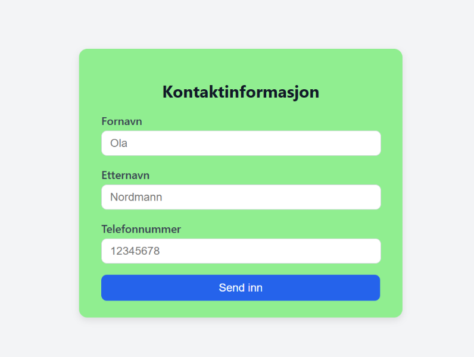
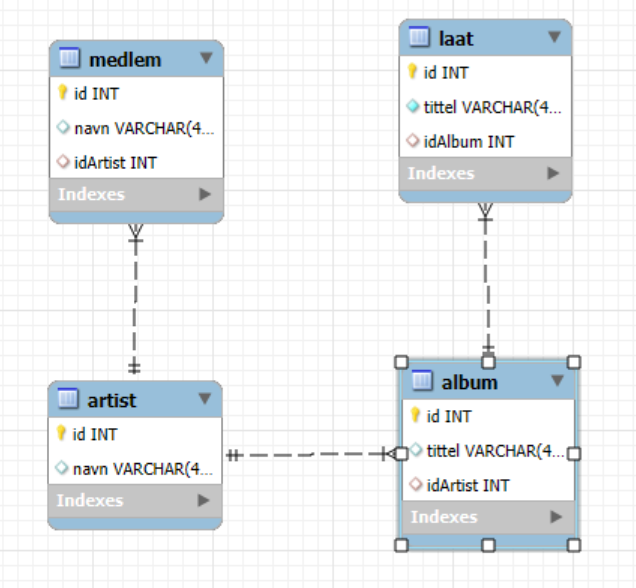
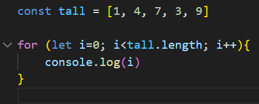
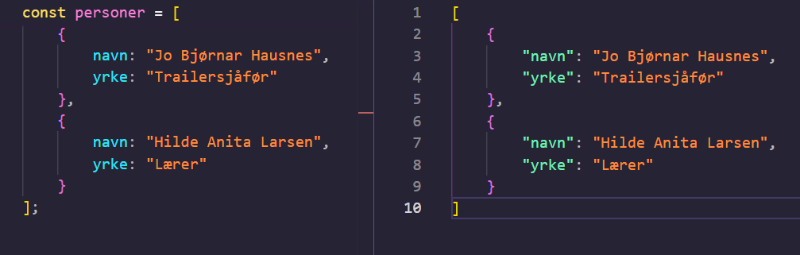

# Oppgave - Muntlig-praktisk HTML, CSS, JS, SQL

Dette er et eksempel på oppgaver du kan få i en muntlig-praktisk sammenheng, der du altså blir bedt om å kode noe "live" foran en sensor eller lærer. Oppgavene kan variere i vanskelighetsgrad og omfang, men de vil alltid involvere praktisk koding og problemløsning.

Løs disse oppgavene mest mulig uten hjelpemidler, med unntak av de "cheat sheets" du har fått utdelt på forhånd. Målet er å vise at du kan anvende kunnskapen din i praksis, ikke at du får KI til å gjøre jobben for deg.

## Oppgave 1



Over ser du en input form som er midtstilt på nettsiden. Skriv HTML og CSS for å gjenskape formen (skjemaet). Husk "luft" mellom elementene. 

Farger som er brukt er lightgreen, blue og white.

## Oppgave 2


Gjenskap nettsiden over. Den skal være responsiv, dvs. at når vindusstørrelsen minker, kommer bildene under hverandre.

## Oppgave 3



Her er en forenklet databasemodel av en musikkdatatabase. Kan du forklare hvilke type nøkler som brukes for å koble tabellene sammen? Referer til de faktiske nøklene i modellen.

## Oppgave 4

Gitt en database basert på modellen fra oppgave 3, skriv SQL for å hente ut alle låtene til en artist som heter "ABBA".

## Oppgave 5


Denne modellen fungerer ikke for album, der flere artister er med på albumet. Beskriv en løsning der det er mulig å registrere at flere artister bidrar på et album.

## Oppgave 6



Her ser du kode for å skrive ut kode som skriver ut alle tall i en array.Skriv ny kode, slik at den kun skriver ut det minste tallet.

## Oppgave 7

Gitt en array med temperaturer, f.eks 

```js
const temperatur = [-10, 4, 7, 13, -9, 6, -11, -12, 14];
```

Lag en funksjon som tar en array med temperaturer som parameter, og returnerer antall temperaturer som er mindre enn 0.

## Oppgave 8

Lag en funksjon som tar inn en array av personobjekter, samt et lønnsnivå som parameter. Et personobjekt inneholder informasjon om navn, alder og lønn. Funksjonen skal returnere antall personer som tjener mer enn oppgitt lønnsnivå.

## Oppgave 9



NB: Velg enten objekt-variabelen til venstre, ELLER JSON-filen til høyre som utgangspunkt når du løser denne oppgaven.

Skriv nødvendig kode for å gå gjennom samlingen med data, og generer/opprett/lag HTML-kode.